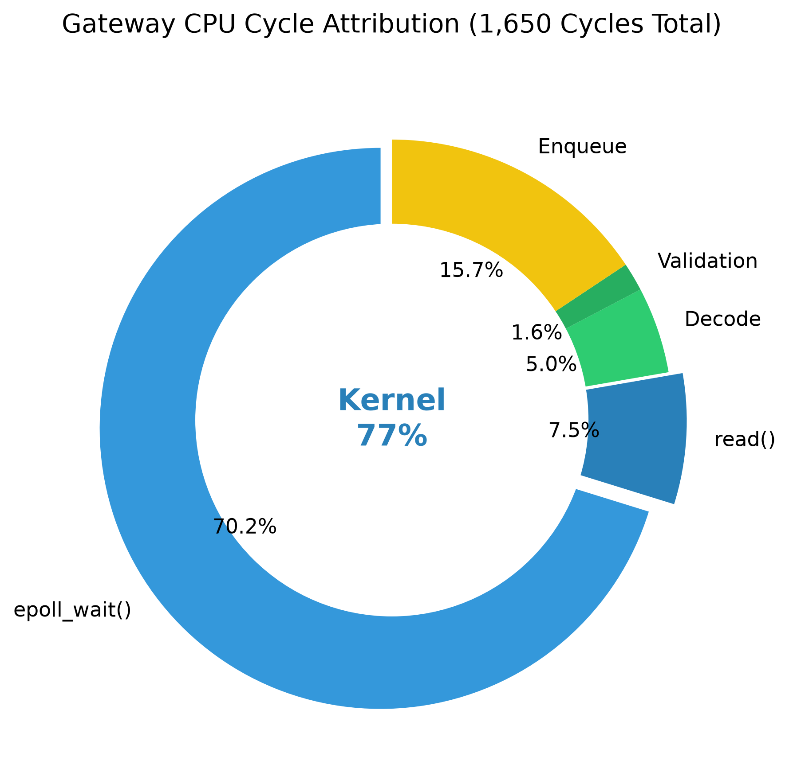
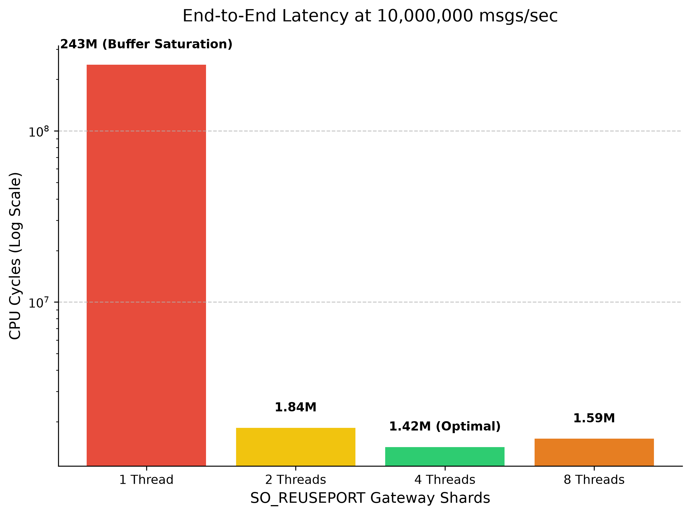

# Benchmarks & Capacity Planning

## Benchmark Scope
The goal of these experiments is not to measure the theoretical minimum possible latency of an isolated order in a vacuum.

Instead, the system is intentionally stressed under massive sustained load (1,000,000 to 10,000,000 messages per second) to empirically study:
- Throughput capacity limits
- Non-linear queueing effects under saturation
- Gateway horizontal scalability via `SO_REUSEPORT`
- Kernel networking overhead vs Application logic cost
- Thread oversubscription boundaries

## Test Environment

### Hardware
*   **CPU:** Intel Core i5-1240P (~4.4 GHz Max Turbo)
*   **Memory Architecture:** Unified NUMA node

### Software
*   **OS:** Ubuntu 24.04.3 LTS (Linux Kernel)
*   **Compiler:** GCC / Clang (C++17/20, `-O3` Release Mode)

## Measurement Methodology

### RDTSCP Timestamping
Standard timing APIs introduce measurable observer overhead relative to direct TSC reads. To achieve true cycle-accurate profiling without inflating latency (the Heisenberg effect), the system injects the x86 hardware intrinsic `__rdtscp` directly into the packet payloads. 

### Latency Attribution
This allows us to track the exact lifecycle of an order across thread and network boundaries, decomposing the latency into its constituent parts:
1.  **TCP Path:** Network traversal and kernel queueing.
2.  **SPSC Queue:** Lock-free inter-thread handoff.
3.  **Trading Engine:** Application business logic (Risk + Matching).

---

## Gateway Cycle Attribution
Before analyzing macro-level throughput, we must understand where the CPU cycles are being spent at a micro-level. 
The following data was captured at the optimal **4-Thread configuration processing 10,000,000 messages per second**.

| Pipeline Stage | Cycle Cost | Percentage | Description |
| :--- | :--- | :--- | :--- |
| **`epoll_wait()`** | 1,157 cycles | ~70% | Kernel: Polling for socket events |
| **`read()`** | 124 cycles | ~7.5% | Kernel: Copying data to userspace |
| **Decode** | 82 cycles | ~5% | Application: Parsing binary OUCH protocol |
| **Validation** | 27 cycles | ~1.6% | Application: Pre-trade risk checks |
| **Enqueue** | 258 cycles | ~15.6% | Application: Push to Lock-Free SPSC Queue |
| **Total Cost** | **1,650 cycles** | **100%** | Total CPU cycles per order |

**Engineering Insight:** The actual application business logic (Decode + Validate + Enqueue) executes in **~367 CPU cycles** (sub-100ns on this test machine). The Linux kernel networking stack (`epoll_wait` + `read`) accounts for **~77%** of the total ingestion overhead.

---

## Capacity Scaling Matrix

This full matrix demonstrates system performance across various scaling vectors, validating the `SO_REUSEPORT` architectural decisions.

| Load (msgs/sec) | Gateway Threads | TCP Path (Queueing) | Engine Logic | End-to-End Latency | Status |
| :--- | :--- | :--- | :--- | :--- | :--- |
| **1,000,000** | 1 | 34,837 cycles | 4,664 cycles | 1,116,847 cycles | Stable |
| **1,000,000** | 2 | 33,542 cycles | 4,868 cycles | 1,154,419 cycles | Stable |
| **1,000,000** | 4 | 39,363 cycles | 3,582 cycles | 1,113,762 cycles | Stable |
| **1,000,000** | 8 | 44,869 cycles | 4,304 cycles | 1,087,882 cycles | Stable |
| **2,000,000** | 1 | 71,818 cycles | 4,936 cycles | 1,302,838 cycles | Stable |
| **2,000,000** | 2 | 50,510 cycles | 4,249 cycles | 958,715 cycles | Stable |
| **2,000,000** | 4 | 82,830 cycles | 4,360 cycles | 1,179,687 cycles | Stable |
| **2,000,000** | 8 | 372,544 cycles | 4,364 cycles | 1,365,468 cycles | Degraded (Oversubscription Effects) |
| **5,000,000** | 1 | 195,671,018 cycles | 4,997 cycles | 196,813,156 cycles | Saturation (Queueing Delay) |
| **5,000,000** | 2 | 511,845 cycles | 5,587 cycles | 1,602,905 cycles | Stable |
| **5,000,000** | 4 | 416,071 cycles | 5,170 cycles | 1,692,150 cycles | Stable |
| **5,000,000** | 8 | 498,648 cycles | 4,925 cycles | 1,511,991 cycles | Stable |
| **10,000,000** | 1 | 242,392,082 cycles | 5,604 cycles | 243,483,071 cycles | Saturation (Queueing Delay) |
| **10,000,000** | 2 | 781,801 cycles | 5,727 cycles | 1,840,357 cycles | Stable |
| **10,000,000** | 4 | **456,058 cycles** | **4,415 cycles** | **1,422,379 cycles** | **Optimal Balance** |
| **10,000,000** | 8 | 314,940 cycles | 5,470 cycles | 1,588,183 cycles | CPU Oversubscription |

---

## Key Findings

1. **Single-Thread epoll Ceiling:** A single `epoll` ingestion loop hits its capacity threshold near 4M msgs/sec. Pushing 5M or 10M messages into a single gateway thread causes sustained TCP receive-buffer saturation and severe queueing delay.
2. **Queueing Delay Dominates Latency:** At 10M msgs/sec on 1 thread, the Trading Engine logic remains blazing fast (~5,600 cycles), but the TCP Queueing Delay spikes to over 240,000,000 cycles (~60ms). Under network saturation, queueing delay fundamentally dictates end-to-end performance.
3. **SO_REUSEPORT Scalability:** Distributing the TCP ingress load across multiple shards reduces queueing delay by several orders of magnitude. Shifting from 1 to 4 threads at 10M msgs/sec erased the 60ms delay, restoring end-to-end latency to ~355µs.
4. **The 4-Thread Sweet Spot:** For this specific machine (Intel i5-1240P), four Gateway threads provided the optimal balance between aggregate throughput and individual cycle efficiency.
5. **Thread Oversubscription Penalties:** Additional Gateway threads (e.g., 8 threads) caused diminishing returns. The combination of 8 Gateways + 8 Engines + the Load Generator physically oversubscribed the cores, increasing latency via L3 cache contention and OS scheduler overhead.

## Conclusions
The system successfully met its goal of processing 10,000,000 messages per second. At the optimal 4-thread configuration, the system sustained 10,000,000 messages/sec while maintaining end-to-end latency of 1.42M cycles and core business-logic execution of approximately 350–370 cycles. The profiling indicates that the primary scaling bottleneck lies outside the application business logic and within the kernel networking path, laying the groundwork for future exploration of kernel-bypass technologies such as DPDK or ef_vi.
